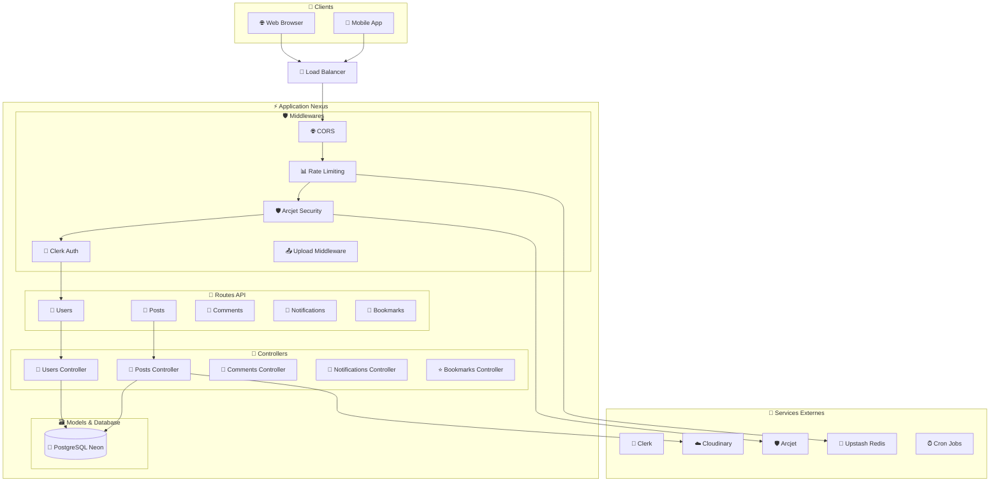
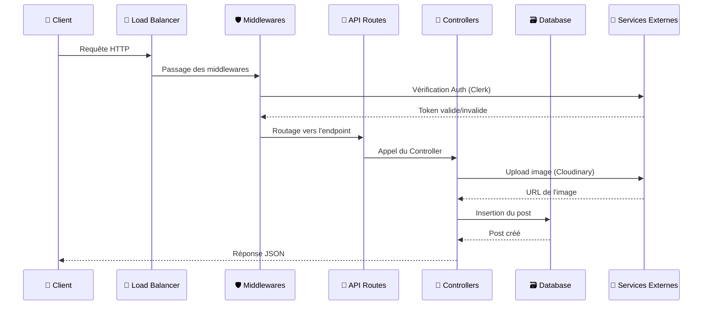
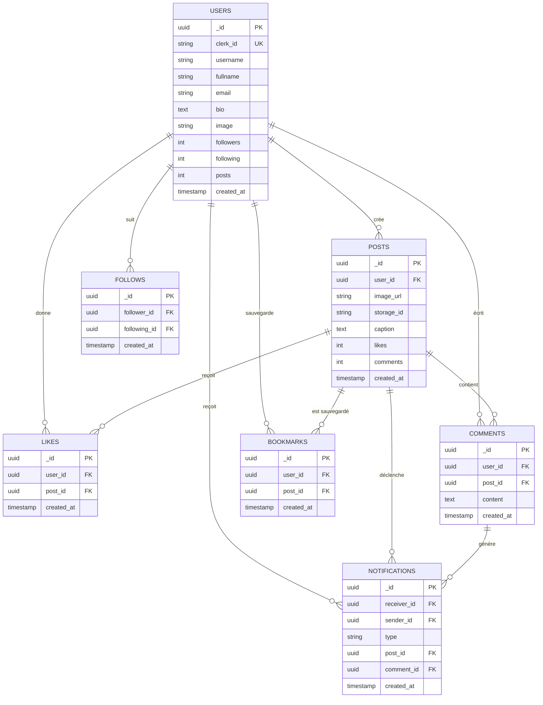
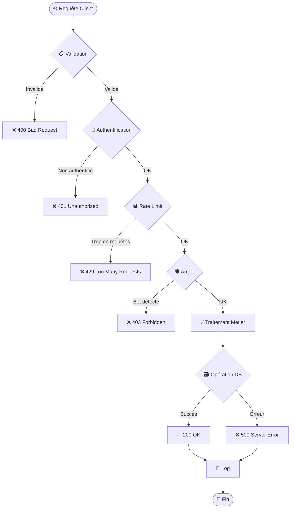

<div align="center">

# 📱 Nexus — API Backend de l’Application de Réseau Social  

🌀 Backend API construit avec **Express.js**, **PostgreSQL (Neon)** et **Clerk** pour une authentification sécurisée.

</div>

---

## 🚀 Fonctionnalités

### 👥 Gestion des Utilisateurs
- ✅ Authentification sécurisée avec **Clerk**  
- 👤 Profils personnalisables (photo, bio, bannière)  
- 🔍 Système de followers (suivre / ne plus suivre)  
- 📝 Informations personnelles enrichies  

### 📱 Publications
- ✨ Création de posts avec texte et images  
- 🖼️ Upload via **Cloudinary**  
- ❤️ Likes en temps réel  
- 🗑️ Suppression avec confirmation  
- 📊 Compteurs de likes & commentaires  

### 💬 Interactions Sociales
- 💬 Commentaires sur les posts  
- 🔖 Bookmarks (posts favoris)  
- 🔔 Notifications dynamiques  
- 👀 Flux d’actualités personnalisé  

### 🛡️ Sécurité & Performance
- 🔒 Authentification **JWT** via Clerk  
- 🛡️ Protection **Arcjet** contre les bots  
- ⚡ Rate limiting via **Upstash Redis**  
- 📡 API RESTful structurée  
- 🚀 Optimisation des performances  

---

## 🛠️ Stack Technique

| Catégorie | Technologies |
|------------|--------------|
| **Backend** | Node.js • Express.js |
| **Base de données** | PostgreSQL (Neon) |
| **Auth** | Clerk |
| **Stockage d'images** | Cloudinary |
| **Sécurité** | Arcjet |
| **Cache / Rate Limit** | Upstash Redis |

---

## 📦 Installation

### 🔧 Prérequis
- Node.js **v18+**  
- Compte **Clerk**  
- Base de données **PostgreSQL (Neon)**  
- Compte **Cloudinary**

---

### ⚙️ Étapes d’installation

#### 1️⃣ Cloner le projet
```bash
git clone https://github.com/Maxime015/nexus-backend.git
cd nexus-backend
```

#### 2️⃣ Installer les dépendances
```bash
npm install
```

#### 3️⃣ Configurer les variables d’environnement
```bash
cp .env.example .env
```

Puis remplir le fichier `.env` :
```env
# Database
DATABASE_URL=votre_url_neon

# Authentication
CLERK_PUBLISHABLE_KEY=votre_cle_publique
CLERK_SECRET_KEY=votre_cle_secrete

# Cloudinary
CLOUDINARY_CLOUD_NAME=votre_nom_cloud
CLOUDINARY_API_KEY=votre_cle_api
CLOUDINARY_API_SECRET=votre_secret

# Security
ARCJET_KEY=votre_cle_arcjet

# Redis
UPSTASH_REDIS_REST_URL=votre_url_redis
UPSTASH_REDIS_REST_TOKEN=votre_token_redis

# App
PORT=3000
NODE_ENV=development
API_URL=http://votre_url_render_ou_vercel/health
```

#### 4️⃣ Lancer l’application
```bash
# Mode développement
npm run dev

# Mode production
npm start
```

---

## 🗃️ Structure de la Base de Données

| Table | Description |
|--------|--------------|
| 👥 users | Utilisateurs |
| 📝 posts | Publications |
| ❤️ likes | Likes des posts |
| 💬 comments | Commentaires |
| 👀 follows | Relations de suivi |
| 🔔 notifications | Notifications |
| 🔖 bookmarks | Posts favoris |

---

## 🏗️ Architecture du Système



---

## 📊 Flux de Données



---

## 🗂️ Structure des Données



---

## 🔄 Flux des Requêtes



---

## 📚 Documentation API

### 🔗 Accès
```
http://localhost:3000/api-docs
```

### 🛣️ Endpoints Principaux

#### 👥 Utilisateurs
```
POST   /api/users/sync
GET    /api/users/me
GET    /api/users/profile/:id
PUT    /api/users/profile
GET    /api/users/is-following/:followingId
POST   /api/users/toggle-follow
```

#### 📝 Publications
```
POST   /api/posts
GET    /api/posts/feed
GET    /api/posts/user/:userId
DELETE /api/posts/:postId
POST   /api/posts/toggle-like
```

#### 💬 Commentaires
```
POST   /api/comments
GET    /api/comments/:postId
```

#### 🔖 Favoris
```
POST   /api/bookmarks/toggle
GET    /api/bookmarks
```

#### 🔔 Notifications
```
GET    /api/notifications
```

---

## 🤝 Contribution

1. 🍴 Fork du projet  
2. 🌿 Crée une branche :
   ```bash
   git checkout -b feature/NouvelleFeature
   ```
3. 💾 Commit :
   ```bash
   git commit -m "Add NouvelleFeature"
   ```
4. 📤 Push :
   ```bash
   git push origin feature/NouvelleFeature
   ```
5. 🔀 Ouvre une Pull Request  

---

## 📄 Licence
Distribué sous la licence **MIT**.  
Voir [`LICENSE`](LICENSE) pour plus de détails.

---

## 👨‍💻 Auteur
**Maxime ANANIVI** — Développeur principal  
[GitHub](https://github.com/Maxime015) • [Portfolio](https://votresite.com)

---

## 🙏 Remerciements
- [Clerk](https://clerk.dev) — Authentification sécurisée  
- [Cloudinary](https://cloudinary.com) — Stockage et optimisation d’images  
- [Neon](https://neon.com) — PostgreSQL serverless  
- [Arcjet](https://arcjet.com) — Sécurité avancée  
- [Upstash](https://upstash.com) — Redis & Rate Limiting  

